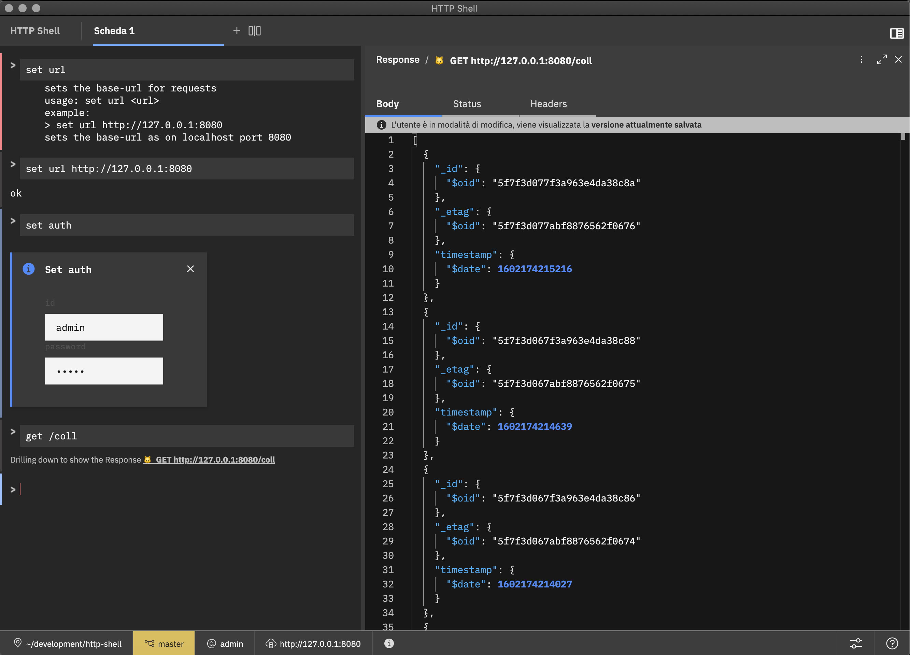

# HTTP Shell

**HTTP Shell** is a tool that provides developers a modern alternative to http clients for interacting with APIs.



## Usage

### typical usage

```
> set url http://127.0.0.1:8080

> set auth

> edit /tmp/message.json

> put messages/foo /tmp/message.json

> get messages/foo
```

- With `set url` and `set auth` we set the *base URL* and the *basic authentication* credentials to use in further requests.

- The command `edit` opens the [Monaco Editor](https://github.com/Microsoft/monaco-editor) to create the json file `message.json`.

- The following `put` command executes the `PUT` HTTP request on the URL `http://127.0.0.1:8080/messages/foo` (that is the *base URL* plus the specified resource URI(), sending the request body from the file `message.json`.

- The following `get` command executes the `GET` HTTP requests respectively on the URL `http://127.0.0.1:8080/messages/foo` opening the response body in the Shell sidecar.

### commands

| command | description | example
|---|---|---|
| set auth <id> <password> | opens a dialog to sets the basic authentication credentials to use in further requests | > set auth |
| reset auth | clear the basic authentication credentials | > reset auth |
| set url <url> | sets the base url to use in further requests | > set url http://127.0.0.1:8080 |
| get url | prints the base url | > get url |
| get <uri> | executes the GET request to url=<base-url>+<uri> | > get /collection |
| edit <file> | opens <file> for editing | > edit body.json |
| post <uri> <file> | executes the request POST <base-url>+<uri>, sending the content of <file> as the request body | > post /collection body.json |
| put <uri> <file> | executes the request PUT <base-url>+<uri>, sending the content of <file> as the request body | > put /collection body.json |
| patch <uri> <file> | executes the request PATCH <base-url>+<uri>, sending the content of <file> as the request body | > patch /collection body.json |
| delete <uri> | executes the DELETE request to url=<base-url>+<uri> | > delete /collection |
| set header <name> <value> | set the header <name> to <value> | > set header If-Match 5f7f35efcb800f2502f95cb5 |
| get headers | prints the current set headers | > get headers |
| clear headers | clears the headers | > clear headers |


## Build from source

First step:

```sh
npm ci
```

Next, choose your adventure from the following variants:

### Variant 1: I want to develop an Electron client

Use these commands while developing. The first starts up the webpack
watcher. Each time you execute the second, an Electron window will
open.

```sh
npm run watch
npm run open
```

And use one of these commands to build production clients, after which
your clients will be placed in `./dist/electron`.

```sh
npm run build:electron:all
npm run build:electron:mac
npm run build:electron:linux
npm run build:electron:windows
```

### Variant 2: I want to develop a browser-based client

Use this command while developing:

```sh
npm run watch:source
npm run watch:webpack
```

Then visit http://localhost:9080. To build a production set of webpack
bundles, use this command:

```sh
npx kui-build-webpack
```

## Get help

As soon as the shell starts, get commands usage help with:

```
> help http-shell
```

## Acknowledgments

Project derived from [AnimalApp Kui skeleton project](https://github.com/IBM/kui/tree/master/docs/example/AnimalApp)

## Contribute

[GitHub](https://github.com/softinstigate/http-shell "HTTP Shell's GitHub page")

[Bugs](https://github.com/softinstigate/http-shell/issues/new "HTTP Shell's bug reporting page")
